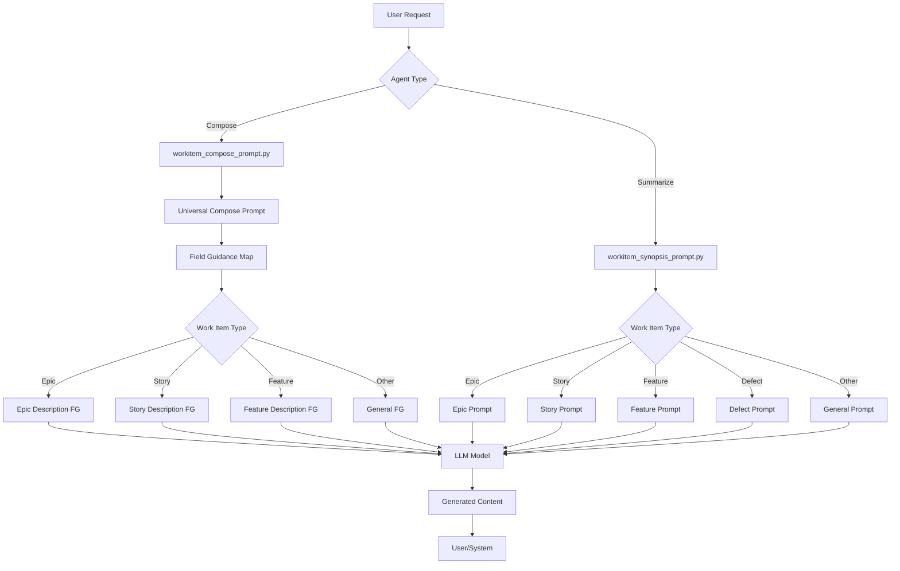
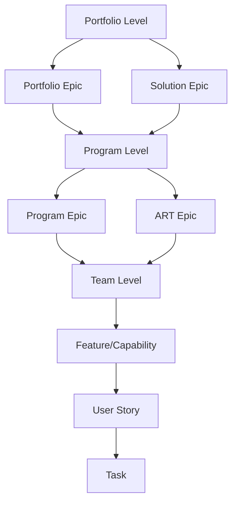

# EWM Agent Architecture - Comprehensive Guide

## Table of Contents
1. [Overview](#overview)
2. [System Architecture](#system-architecture)
3. [File 1: workitem_compose_prompt.py](#file-1-workitem_compose_promptpy)
4. [File 2: workitem_synopsis_prompt.py](#file-2-workitem_synopsis_promptpy)
5. [Prompt Engineering Patterns](#prompt-engineering-patterns)
6. [SAFe & Work Item Types](#safe--work-item-types)
7. [Building Your Own Agent](#building-your-own-agent)

---

## Overview

### What is EWM?
**EWM (Engineering Workflow Management)** is IBM's agile project management tool, part of the **ELM (Engineering Lifecycle Management)** suite. It manages work items across the entire software development lifecycle using agile methodologies, particularly **SAFe (Scaled Agile Framework)**.

### Purpose of These Files
These two Python files contain **LLM prompt templates** for AI agents that:
1. **Compose/Generate** content for work item fields (descriptions, acceptance criteria, etc.)
2. **Summarize** existing work items into concise synopses

Think of them as the "brains" of AI assistants that help teams write better work items and understand them quickly.

---

## System Architecture



### Key Components

| Component | Purpose | Location |
|-----------|---------|----------|
| **Compose Agent** | Generates/enhances work item fields | `workitem_compose_prompt.py` |
| **Synopsis Agent** | Summarizes work items | `workitem_synopsis_prompt.py` |
| **Field Guidance (FG)** | Specialized instructions per field type | Both files |
| **LLM Model** | Mistral Small 3.1 24B | Configuration |

---

## File 1: workitem_compose_prompt.py

### Purpose
Generates or enhances **specific fields** within work items (descriptions, acceptance criteria, hypothesis statements, etc.).

### Architecture

#### 1. Universal Compose Prompt (Lines 13-75)
The **master template** that orchestrates all field composition:

```python
universal_compose_prompt = """
<|start_of_role|>system<|end_of_role|>
# Work Item Composition System
...
"""
```

**Key Features:**
- **Two-step process**: Data sufficiency check → Content generation
- **Adaptive**: Works for ANY field type
- **Context-aware**: Uses work item type to determine planning level
- **Preservation-first**: Enhances existing content rather than replacing

**Template Variables:**
- `{compose_field}` - Field being generated (e.g., "Description")
- `{workitem_typename}` - Type of work item (e.g., "Epic", "Story")
- `{workitem_json}` - Complete work item data
- `{field_guidance}` - Specialized instructions for this field

#### 2. Field Guidance Templates (Lines 77-438)

Specialized instructions for different combinations of work item types and fields:

| Template | Work Item Types | Purpose |
|----------|----------------|---------|
| `story_description_FG` | User Story | Generate user-centric descriptions with user needs, flows, scope |
| `feature_description_FG` | Feature, Capability | Generate business value, problem statements, scope boundaries |
| `epic_description_FG` | Epic, ART Epic, Program Epic | Generate strategic rationale, program impact |
| `portfolioEpic_description_FG` | Portfolio Epic, Solution Epic | Generate strategic vision, organizational impact |
| `safe_epic_hypothesis_FG` | ART/Program Epics | Generate testable hypothesis with For statement |
| `portfolioEpic_hypothesis_FG` | Portfolio/Solution Epics | Generate strategic hypothesis with business outcomes |
| `acceptance_criteria_FG` | Stories, Features | Generate testable acceptance criteria |
| `success_criteria_FG` | Epics | Generate measurable success criteria |

**Example - Story Description Template:**
```python
story_description_FG = """
# Story Description Generation

**Generate a complete, well-structured {workitem_typename} description...**

## FOCUS
Translating ideas into actionable user story description.

## FORMAT
1. Generate section names in **bold**
2. Use bullet list format for sections like user flow, user needs

## ⚠️ CRITICAL
- **DO NOT** generate sections like: **Acceptance Criteria**...
"""
```

#### 3. Field Guidance Map (Lines 440-495)

Maps work item types to their appropriate field guidance:

```python
field_guidance_map = {
    config.epic_typeId : {
        config.description_attr : epic_description_FG,
        config.alm_epic_hypothesis_attr : safe_epic_hypothesis_FG,
        config.success_criteria_attr : success_criteria_FG
    },
    config.story_typeId : {
        config.description_attr : story_description_FG,
        config.acceptance_attr : acceptance_criteria_FG,
        ...
    },
    ...
}
```

**How it works:**
1. System receives request: "Generate description for Epic #123"
2. Looks up `epic_typeId` in map
3. Finds `description_attr` → returns `epic_description_FG`
4. Injects this guidance into `universal_compose_prompt`

#### 4. get_field_guidance() Function (Lines 498-531)

**Smart lookup function** with fallback logic:

```python
def get_field_guidance(workitem_typeid, workitem_typename, field_id, field_name):
    # Try specific mapping first
    guidance = field_guidance_map.get(workitem_typeid, {}).get(field_id)
    
    if guidance:
        return guidance.format(workitem_typename=workitem_typename)
    
    # Fallback to general guidance based on field type
    if field_id == config.description_attr:
        return general_description_FG.format(workitem_typename=workitem_typename)
    ...
```

**Fallback Strategy:**
- Primary: Use specific guidance from map
- Secondary: Use general guidance based on field type
- Ensures system never fails to provide guidance

---

## File 2: workitem_synopsis_prompt.py

### Purpose
Creates **concise summaries** of complete work items for quick understanding.

### Architecture

#### 1. Work Item Type-Specific Prompts (Lines 10-452)

Each work item type has a tailored prompt:

| Prompt | Work Item Types | Key Sections |
|--------|----------------|--------------|
| `epic_prompt` | Epic | Overview, Details, Success Criteria, Working Notes, Risks/Dependencies, AI Next Steps |
| `feature_prompt` | Feature, Capability | Overview, Details, Acceptance Criteria, Working Notes, Risks/Dependencies, AI Next Steps |
| `safe_epic_prompt` | ART/Portfolio/Solution Epics | Similar to epic but SAFe-specific |
| `story_prompt` | User Story | Overview, Details, Acceptance Criteria, Working Notes, Risks/Dependencies, AI Next Steps |
| `defect_prompt` | Defect, Bug | Overview, Details, Working Notes, Risks/Dependencies, AI Next Steps |
| `task_prompt` | Task | Overview, Details, Working Notes, Risks/Dependencies, AI Next Steps |
| `retrospective_prompt` | Retrospective | Overview, Details |
| `risk_prompt` | Risk | Overview, Risk Classification, Risk Details, Risk Action, Dependencies, AI Next Steps |
| `impediment_prompt` | Impediment | Overview, Details, Risks/Dependencies, AI Next Steps |
| `general_prompt` | Any other type | Overview, Details, Working Notes, Risks/Dependencies, AI Next Steps |

**Common Structure:**
```python
epic_prompt = """
<|start_of_role|>system<|end_of_role|>
You are Granite, developed by IBM. You are an expert agile coach...

CORE INSTRUCTIONS for Epic work item:
1. **Summarize, don't expand**
2. **ABSOLUTE ZERO REPETITION RULE**
3. **Use only available data**
...

{user_prompt}
<|end_of_text|>

<|start_of_role|>user<|end_of_role|>
Input data: {workitem_json}
<|end_of_text|>

<|start_of_role|>assistant<|end_of_role|>
"""
```

#### 2. Default Section Templates (Lines 458-842)

Detailed section-by-section instructions for each work item type:

**Example - Epic Synopsis Structure:**
```python
default_epic_prompt = """
SECTION RULES:

**Overview** (required, 1 paragraph)
Summarize: planned for, filed against, owner, State, main purpose...

**Details** (if available)
- Summarize description/Epic hypothesis statement...
- **Associated Requirements** (only if fields exist)...

**Success criteria** (if available)
Summarize Success criteria as concise bullet points...

**Working notes** (if available)
- Extract and summarize key points from comments...

**Associated Defects/Risks/Dependencies** (if available)
- **Affected by defects**...
- **Dependencies/Blockers**...
- **Risks**...

**AI recommended next steps** (Conditional - only if NOT closed)
CRITICAL: Check Status.group field...
"""
```

#### 3. Configuration Object (Lines 844-858)

```python
default_configuration = { 
    "model_id" : "mistralai/mistral-small-3-1-24b-instruct-2503",
    "synopsis_prompts" : {
        "epic_prompt" : default_epic_prompt,
        "feature_prompt" : default_feature_prompt,
        ...
    }
}
```

---

## Prompt Engineering Patterns

### 1. **Role-Based Prompting**
```
You are an expert agile practitioner and specialist in agile product development.
```
- Establishes expertise and context
- Sets tone and expected knowledge level

### 2. **Structured Instructions**
```
## STEP 1: DATA SUFFICIENCY CHECK
## STEP 2: CONTENT GENERATION
```
- Clear sequential steps
- Prevents premature generation
- Ensures quality control

### 3. **Constraint-Based Generation**
```
⚠️ CRITICAL
- **DO NOT** generate sections like: **Acceptance Criteria**
- **DO NOT** use heading "Description"
```
- Explicit prohibitions prevent common errors
- Ensures output format compliance

### 4. **Context Injection**
```python
guidance = guidance.format(workitem_typename=workitem_typename)
```
- Dynamic variable substitution
- Adapts prompts to specific contexts

### 5. **Zero Repetition Rule**
```
ABSOLUTE ZERO REPETITION RULE - MANDATORY: 0% repetition tolerance.
Each piece of information must appear EXACTLY ONCE...
```
- Prevents redundancy in summaries
- Ensures concise, efficient output

### 6. **Conditional Logic**
```
**AI recommended next steps** (Conditional - include only if work item is NOT closed)
CRITICAL: Check the work item's completion status using the "Status" field:
- If Status.group = "done" OR Status.group = "close" → OMIT this section
```
- Dynamic section inclusion
- Context-aware output

### 7. **Format Specifications**
```
## FORMAT
1. Generate section names in **bold**
2. Use bullet list format for sections like user flow
```
- Ensures consistent markdown output
- Improves readability

### 8. **Preservation Rules**
```
### Content Preservation Rules (when {compose_field} has existing content):
→ **PRESERVE existing sections and their content**
→ **ENHANCE quality** by improving clarity
→ **ADD missing sections**
```
- Prevents data loss
- Encourages enhancement over replacement

### 9. **Fallback Mechanisms**
```python
guidance = field_guidance_map.get(workitem_typeid, {}).get(field_id)
if guidance:
    return guidance
# Fallback to general guidance
```
- Graceful degradation
- System never fails completely

### 10. **Template Variables**
```
{workitem_json}
{workitem_typename}
{compose_field}
{field_guidance}
```
- Flexible, reusable templates
- Easy to maintain and extend

---

## SAFe & Work Item Types

### SAFe Planning Levels



### Work Item Type Hierarchy

| Level | Work Item Types | Purpose | Audience |
|-------|----------------|---------|----------|
| **Portfolio** | Portfolio Epic, Solution Epic | Strategic initiatives, enterprise-wide | Executives, Portfolio Managers |
| **Program** | Program Epic, ART Epic, Epic | Program-level coordination, multi-PI | Program Managers, ARTs |
| **Team** | Feature, Capability | Deliverable functionality | Product Owners, Teams |
| **Execution** | User Story, Task | Implementation details | Developers, Testers |
| **Quality** | Defect, Bug | Issues and fixes | QA, Developers |
| **Process** | Risk, Impediment, Retrospective | Process improvement | Scrum Masters, Teams |

### Key SAFe Concepts in the Code

#### 1. **Epic Hypothesis Statement**
```python
safe_epic_hypothesis_FG = """
**Epic Hypothesis Statement should have For statement in this format:**
> For `<customers>` who `<do something>` 
> the `<solution>` is a `<something - the "how">` 
> that `<provides this value>` 
> Unlike `<competitor>` 
> our solution `<does something better>`
"""
```

**Purpose:** Testable hypothesis for epic value delivery

#### 2. **Planning Levels**
```python
# ART Epic = Single-ART features, program-level delivery
# Program Epic = Program-wide coordination, ART outcomes
# Portfolio Epic = Strategic business value, enterprise-wide
```

#### 3. **Acceptance vs Success Criteria**
- **Acceptance Criteria**: Team/Feature level - "What must be done?"
- **Success Criteria**: Epic level - "How do we measure success?"

#### 4. **Work Item Relationships**
```python
**Associated Requirements** (only if tracksRequirement, implementsRequirement, 
or affectsRequirement fields exist)
**Dependencies/Blockers**: Blocks, Blocked By, Depends On
**Affected by defects**: Defects impacting this work item
```

---

## Building Your Own Agent

### Step 1: Define Your Agent's Purpose

**Questions to answer:**
1. What task will your agent perform?
   - Generate content? Summarize? Analyze? Transform?
2. What input will it receive?
   - Work item data? User requirements? Code? Documents?
3. What output should it produce?
   - Descriptions? Reports? Code? Recommendations?

**Example:**
```
Agent Purpose: Generate test plans from user stories
Input: User story JSON with acceptance criteria
Output: Structured test plan with test cases
```

### Step 2: Identify Work Item Types

**Map your domain to work item types:**

```python
# Example: Test Plan Agent
test_plan_types = {
    'story': 'User Story',
    'feature': 'Feature',
    'defect': 'Defect'
}
```

### Step 3: Create Prompt Templates

**Follow the pattern:**

```python
# 1. Universal template (like universal_compose_prompt)
universal_test_plan_prompt = """
<|start_of_role|>system<|end_of_role|>
# Test Plan Generation System

You are an expert QA engineer and test architect.

## STEP 1: ANALYZE REQUIREMENTS
Evaluate if sufficient information exists to generate test plan:
- Check for acceptance criteria
- Check for user flows
- Check for edge cases

## STEP 2: GENERATE TEST PLAN
{field_guidance}

<|end_of_text|>
<|start_of_role|>user<|end_of_role|>
Work Item Data: {workitem_json}
Work Item Type: {workitem_typename}
<|end_of_text|>
<|start_of_role|>assistant<|end_of_role|>
"""

# 2. Specific guidance templates
story_test_plan_FG = """
# User Story Test Plan Generation

## FOCUS
Creating comprehensive test coverage for user stories

## TEST CATEGORIES
1. **Functional Tests**: Verify acceptance criteria
2. **UI Tests**: Validate user interface elements
3. **Integration Tests**: Check system interactions
4. **Edge Cases**: Test boundary conditions

## FORMAT
- Use Given-When-Then format for test cases
- Include expected results
- Specify test data requirements
"""

feature_test_plan_FG = """
# Feature Test Plan Generation

## FOCUS
End-to-end testing across multiple stories

## TEST CATEGORIES
1. **Feature Tests**: Validate complete feature flow
2. **Performance Tests**: Check scalability
3. **Security Tests**: Verify access controls
4. **Regression Tests**: Ensure no breaking changes
"""
```

### Step 4: Create Guidance Map

```python
test_plan_guidance_map = {
    'story_typeId': {
        'test_plan_attr': story_test_plan_FG
    },
    'feature_typeId': {
        'test_plan_attr': feature_test_plan_FG
    },
    'defect_typeId': {
        'test_plan_attr': defect_test_plan_FG
    }
}

def get_test_plan_guidance(workitem_typeid, workitem_typename):
    guidance = test_plan_guidance_map.get(workitem_typeid, {}).get('test_plan_attr')
    
    if guidance:
        return guidance.format(workitem_typename=workitem_typename)
    
    # Fallback
    return general_test_plan_FG.format(workitem_typename=workitem_typename)
```

### Step 5: Implement Agent Logic

```python
class TestPlanAgent:
    def __init__(self, model_id="mistralai/mistral-small-3-1-24b-instruct-2503"):
        self.model_id = model_id
    
    def generate_test_plan(self, workitem_json, workitem_typeid, workitem_typename):
        """Generate test plan for a work item"""
        
        # Get appropriate guidance
        field_guidance = get_test_plan_guidance(workitem_typeid, workitem_typename)
        
        # Build prompt
        prompt = universal_test_plan_prompt.format(
            field_guidance=field_guidance,
            workitem_json=workitem_json,
            workitem_typename=workitem_typename
        )
        
        # Call LLM
        response = self.call_llm(prompt)
        
        return response
    
    def call_llm(self, prompt):
        # Implementation depends on your LLM integration
        # Could be IBM watsonx, OpenAI, Anthropic, etc.
        pass
```

### Step 6: Add Validation & Error Handling

```python
def generate_test_plan(self, workitem_json, workitem_typeid, workitem_typename):
    """Generate test plan with validation"""
    
    # Validate input
    if not workitem_json:
        raise ValueError("Work item data is required")
    
    # Check for minimum required fields
    required_fields = ['description', 'acceptance_criteria']
    missing_fields = [f for f in required_fields if f not in workitem_json]
    
    if missing_fields:
        return f"Insufficient information: Missing {', '.join(missing_fields)}"
    
    # Generate
    try:
        field_guidance = get_test_plan_guidance(workitem_typeid, workitem_typename)
        prompt = universal_test_plan_prompt.format(
            field_guidance=field_guidance,
            workitem_json=json.dumps(workitem_json, indent=2),
            workitem_typename=workitem_typename
        )
        
        response = self.call_llm(prompt)
        
        # Validate output
        if not response or len(response) < 100:
            return "Generated test plan is too short. Please provide more details."
        
        return response
        
    except Exception as e:
        return f"Error generating test plan: {str(e)}"
```

### Step 7: Configuration & Extensibility

```python
# Configuration file
test_plan_config = {
    "model_id": "mistralai/mistral-small-3-1-24b-instruct-2503",
    "max_tokens": 2000,
    "temperature": 0.7,
    "guidance_map": test_plan_guidance_map,
    "supported_types": [
        "story_typeId",
        "feature_typeId",
        "defect_typeId"
    ]
}

# Make it easy to add new types
def register_work_item_type(type_id, guidance_template):
    """Register a new work item type with its guidance"""
    test_plan_guidance_map[type_id] = {
        'test_plan_attr': guidance_template
    }
    test_plan_config['supported_types'].append(type_id)
```

### Best Practices for Your Agent

#### 1. **Modular Design**
```python
# Separate concerns
class PromptBuilder:
    """Handles prompt construction"""
    pass

class GuidanceManager:
    """Manages field guidance templates"""
    pass

class LLMInterface:
    """Handles LLM communication"""
    pass

class TestPlanAgent:
    """Orchestrates the components"""
    def __init__(self):
        self.prompt_builder = PromptBuilder()
        self.guidance_manager = GuidanceManager()
        self.llm = LLMInterface()
```

#### 2. **Comprehensive Logging**
```python
import logging

logger = logging.getLogger(__name__)

def generate_test_plan(self, workitem_json, workitem_typeid, workitem_typename):
    logger.info(f"Generating test plan for {workitem_typename} (ID: {workitem_typeid})")
    
    try:
        # ... generation logic ...
        logger.info("Test plan generated successfully")
        return response
    except Exception as e:
        logger.error(f"Failed to generate test plan: {str(e)}", exc_info=True)
        raise
```

#### 3. **Testing Strategy**
```python
import unittest

class TestPlanAgentTests(unittest.TestCase):
    def setUp(self):
        self.agent = TestPlanAgent()
    
    def test_story_test_plan_generation(self):
        """Test test plan generation for user story"""
        workitem = {
            'type': 'story',
            'description': 'As a user, I want to login...',
            'acceptance_criteria': ['User can enter credentials', ...]
        }
        
        result = self.agent.generate_test_plan(
            workitem, 
            'story_typeId', 
            'User Story'
        )
        
        self.assertIsNotNone(result)
        self.assertIn('Functional Tests', result)
    
    def test_insufficient_data_handling(self):
        """Test handling of insufficient data"""
        workitem = {'type': 'story'}  # Missing required fields
        
        result = self.agent.generate_test_plan(
            workitem,
            'story_typeId',
            'User Story'
        )
        
        self.assertIn('Insufficient information', result)
```

#### 4. **Documentation**
```python
def generate_test_plan(self, workitem_json, workitem_typeid, workitem_typename):
    """
    Generate a comprehensive test plan for a work item.
    
    Args:
        workitem_json (dict): Complete work item data including:
            - description: Work item description
            - acceptance_criteria: List of acceptance criteria
            - type: Work item type
        workitem_typeid (str): Type ID from EWM (e.g., 'story_typeId')
        workitem_typename (str): Human-readable type name (e.g., 'User Story')
    
    Returns:
        str: Generated test plan in markdown format with sections:
            - Test Objectives
            - Test Cases (Given-When-Then format)
            - Test Data Requirements
            - Expected Results
    
    Raises:
        ValueError: If required fields are missing
        LLMError: If LLM call fails
    
    Example:
        >>> agent = TestPlanAgent()
        >>> workitem = {
        ...     'description': 'User login feature',
        ...     'acceptance_criteria': ['Valid credentials accepted']
        ... }
        >>> plan = agent.generate_test_plan(workitem, 'story_typeId', 'User Story')
    """
    pass
```

### Step 8: Integration Patterns

#### Pattern 1: REST API Integration
```python
from flask import Flask, request, jsonify

app = Flask(__name__)
agent = TestPlanAgent()

@app.route('/api/generate-test-plan', methods=['POST'])
def generate_test_plan_endpoint():
    """REST endpoint for test plan generation"""
    try:
        data = request.json
        result = agent.generate_test_plan(
            data['workitem'],
            data['type_id'],
            data['type_name']
        )
        return jsonify({'test_plan': result, 'status': 'success'})
    except Exception as e:
        return jsonify({'error': str(e), 'status': 'error'}), 400
```

#### Pattern 2: Event-Driven Integration
```python
from kafka import KafkaConsumer, KafkaProducer

class TestPlanEventHandler:
    def __init__(self):
        self.agent = TestPlanAgent()
        self.consumer = KafkaConsumer('workitem-created')
        self.producer = KafkaProducer()
    
    def handle_events(self):
        """Listen for work item creation events"""
        for message in self.consumer:
            workitem = json.loads(message.value)
            
            # Generate test plan
            test_plan = self.agent.generate_test_plan(
                workitem['data'],
                workitem['type_id'],
                workitem['type_name']
            )
            
            # Publish result
            self.producer.send('test-plan-generated', {
                'workitem_id': workitem['id'],
                'test_plan': test_plan
            })
```

#### Pattern 3: CLI Tool
```python
import click

@click.command()
@click.option('--workitem-file', required=True, help='Path to work item JSON file')
@click.option('--type-id', required=True, help='Work item type ID')
@click.option('--type-name', required=True, help='Work item type name')
@click.option('--output', default='test_plan.md', help='Output file path')
def generate_test_plan_cli(workitem_file, type_id, type_name, output):
    """CLI tool for test plan generation"""
    
    # Load work item
    with open(workitem_file, 'r') as f:
        workitem = json.load(f)
    
    # Generate
    agent = TestPlanAgent()
    test_plan = agent.generate_test_plan(workitem, type_id, type_name)
    
    # Save
    with open(output, 'w') as f:
        f.write(test_plan)
    
    click.echo(f"Test plan generated: {output}")

if __name__ == '__main__':
    generate_test_plan_cli()
```

---

## Key Takeaways

### Architecture Principles
1. **Separation of Concerns**: Prompts, guidance, and logic are separate
2. **Extensibility**: Easy to add new work item types and fields
3. **Fallback Mechanisms**: Graceful degradation when specific guidance unavailable
4. **Context-Awareness**: Prompts adapt to work item type and planning level

### Prompt Engineering Lessons
1. **Structure is Key**: Clear steps, sections, and constraints
2. **Context Injection**: Dynamic variables make prompts reusable
3. **Explicit Constraints**: Tell the LLM what NOT to do
4. **Preservation First**: Enhance rather than replace existing content
5. **Conditional Logic**: Adapt output based on work item state

### SAFe Integration
1. **Respect Planning Levels**: Different audiences need different detail levels
2. **Maintain Relationships**: Track dependencies, requirements, defects
3. **Support Hypothesis-Driven Development**: Epic hypothesis statements
4. **Enable Traceability**: Link work items across levels

### Building New Agents
1. **Start Simple**: Begin with one work item type, one field
2. **Follow Patterns**: Use the established template structure
3. **Test Thoroughly**: Validate with real work item data
4. **Document Well**: Clear docs enable team adoption
5. **Iterate**: Gather feedback and refine prompts

---

## Next Steps for Your Agent Development

1. **Define Scope**: What specific problem will your agent solve?
2. **Study Examples**: Analyze how compose and synopsis agents work
3. **Create Templates**: Build your prompt templates following the patterns
4. **Implement Core Logic**: Start with basic functionality
5. **Add Validation**: Ensure quality and error handling
6. **Test with Real Data**: Use actual EWM work items
7. **Gather Feedback**: Iterate based on user experience
8. **Document**: Create user guides and API documentation
9. **Deploy**: Choose integration pattern (API, CLI, event-driven)
10. **Monitor**: Track usage, errors, and performance

---

## Additional Resources

### Understanding EWM/ELM
- IBM Engineering Lifecycle Management documentation
- EWM REST API documentation
- SAFe framework documentation

### Prompt Engineering
- LLM prompt engineering best practices
- Few-shot learning techniques
- Chain-of-thought prompting

### Python Development
- Flask/FastAPI for REST APIs
- Kafka for event-driven architecture
- Click for CLI tools

---

**Document Version**: 1.0  
**Last Updated**: 2026-03-06  
**Author**: EWM AI Team